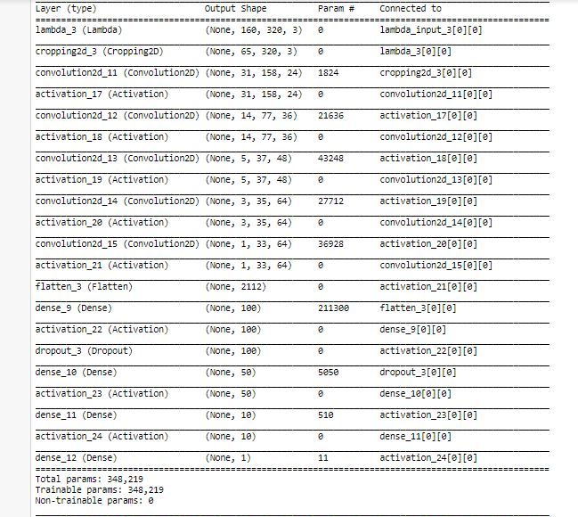

# **Behavioral Cloning**

*My solution to the Udacity Self-Driving Car Engineer Nanodegree Behavioral Cloning project.*

---
### Project Goals
The goals / steps of this project are the following:

* Use the simulator to collect data of good driving behavior
* Build, a convolution neural network in Keras that predicts steering angles from images
* Train and validate the model with a training and validation set
* Test that the model successfully drives around track one without leaving the road
* Summarize the results with a written report

---
### Files Submitted & Code Quality

#### 1. Submission includes all required files and can be used to run the simulator in autonomous mode

My project includes the following files:
* ```model.py``` containing the script to create and train the model
* ```drive.py``` for driving the car in autonomous mode
* ```model.h5``` containing a trained convolution neural network
* ```readup.md``` summarizing the results
* ```video.mp4``` recording our vehicle driving autonomously at least one lap around the track 1.

#### 2. Submission includes functional code

Using the Udacity provided simulator and my ```drive.py``` file, the car can be driven autonomously around the track by executing 
```sh
python drive.py model.h5
```

#### 3. Submission code is usable and readable

The ```model.py``` file contains the code for training and saving the convolution neural network. The file shows the pipeline I used for training and validating the model, and it contains comments to explain how the code works.

---

## Model Architecture and Training Strategy


###  Model Overview

* I decided to test the model provided by NVIDIA as suggested by Udacity. The model architecture is described by NVIDIA [here](https://images.nvidia.com/content/tegra/automotive/images/2016/solutions/pdf/end-to-end-dl-using-px.pdf). As an input this model takes in images of the shape (60,266,3) but our dashboard images/training images are of size (160,320,3). So I keep the architecture of the remaining model same but instead feed an image of different input shape.


### Loading Data

* I used the the dataset provided by Udacity.
* I imported OpenCV to load the images, by default the images are read by OpenCV in BGR format but we need to convert to RGB as  it is processed in RGB format in ```drive.py```.
* Since we have a steering angle associated with three images, I introduce a correction factor of 0.2 for left and right images as the steering angle is captured only by the center angle.
* To be specific, I increase the steering angle by 0.2 for the left images, and decrease the steering angle by 0.2 for the right.

### Preprocessing

* I decided to shuffle the images so that the order in which images comes doesn't matters to the CNN.
* I flip the image horizontally by using cv2 and multiply the steering angle by a factor of -1, in which way I made the data augmentation.
* According to this approach we were able to generate 6 images corresponding to one entry in .csv file.

### Creation of the Training Set & Validation Set

* I analyzed the Udacity Dataset and found out that it contains 9 laps of track 1 with recovery data. I felt these enough and decided to move on.
* I decided to split the dataset into training and validation set using sklearn preprocessing library on a proportion of 85% to 15%.
* By using the generator, I generate the input at the run time in batches of 32 instead of loading all the images in the memory. All of the augmented images are generated inside the generators.

### Final Model Architecture

* I made a little changes to the original NVIDIA architecture, my final architecture looks like in the image below



* My first step is to apply normalization to the all the images.
* Second step is to crop the image 70 pixels from top and 25 pixels from bottom. The image was cropped from top because I did not wanted to distract the model with trees and sky and 25 pixels from the bottom so as to remove the dashboard that is coming in the images.

Sample Input Image-
   

Cropped Image-


* Next Step is to define the first convolutional layer with filter depth as 24 and filter size as (5,5) with (2,2) stride followed by ELU activation function
* Moving on to the second convolutional layer with filter depth as 36 and filter size as (5,5) with (2,2) stride followed by ELU activation function
* The third convolutional layer with filter depth as 48 and filter size as (5,5) with (2,2) stride followed by ELU activation function
* Similarly, we carry on defining two convolutional layer with filter depth as 64 and filter size as (3,3) and (1,1) stride followed by ELU activation funciton
* Next step is to flatten the output from 2D to side by side
* Here we apply first fully connected layer with 100 outputs
* Then comes the first dropout layer with a rate of 0.25 to avoid overfitting
* Next we introduce second fully connected layer with 50 outputs
* Then comes a third connected layer with 10 outputs
* And finally the layer with one output.

We require only one output because this is a regression problem and just need to predict the steering angle.

#### Attempts to reduce overfitting in the model
After the full connected layer I added a dropout layer so that the model generalizes on a track that it has not seen. I decided to keep the dropoout rate as 0.25 to combat overfitting.

#### Parameter tuning

* Number of epochs: 5
* Optimizer: 'Adam'
* Learning Rate: 0.001
* Validation Data split: 0.15
* Generator batch size: 32
* Correction factor: 0.2
* Loss Function: MSE(Mean Squared Error as it is efficient for regression problem).

After a lot of testing on track 1, my final model performed well enough to finish the loop.

### Output Video
Here is my [output video](./video.mp4)

### Important SideNotes

#### Simulator problem in GPU

* I noticed that running simulator on GPU had a problem with latest tensorflow and keras versions.
* "SystemError: unknown opcode" is the error that I used to get while running the simulator on my local machine. Thus I upload my model.h5 to the Udacity workspace and it went successfully.
